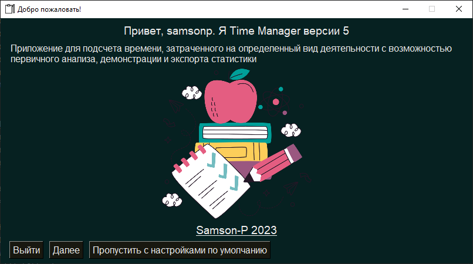

# TimeManager

A window application for calculating the time spent in a certain type of activity with the possibility of primary analysis, demonstration and export of statistics.

## About
Идея проекта была заложена в `2020г.` Тогда я учился по специальности <a href="https://priem.mai.ru/bachelor/programs/">12.03.04</a>, и, в первом же семестре, меня встретил неожиданно интересный предмет "Русский язык и Культура речи". Он то и надоумил меня на создание данного приложения, как инструмента рефлексии над своим образовательным процессом.

Базовый функционал задумывался элементарный — регистрация событий, связанных с обучением/изучением, и отработкой вновь полученных знаний. Но позже, при реализации, появились идеи по улучшению, дополнению проекта.

Представление данных — непосредственно та цель, ради которой данные о событиях, записанные в круги (как в спорте), и собирались на предыдущем этапе. Предварительная обработка — несет более глубокий смысл, позволяя взглянуть на собранные данные уже не в сухом табличном виде, а в виде наглядных диаграмм и, возможно, будет реализована языковая формулировка достижений по длительным периодам.

Одним из параметров сохраняемых кругов хочу сделать коэффициент education/execution. Это веса, показывающие: часть времени круга, которая была затрачена на реализацию конструктивных функций головного мозга, связанных с формулировкой мысли, формирование абстракций, учебу. Вообще говоря, на составление новых связей, синапсов в мозге; и остаток — часть времени, которая была затрачена на исполнение, применение полученных навыков, отработку полученных в процессе обучения ментальных инструментов.

## TODO
Техническое задание:
* Форма: время начала, время конца, интервал, заглавие, описание, флажки (с перерывами/без), ползунок соотношения education/work_experience (execution) (время обучения, время отработки);
* Бизнесс логика: подсчет времени выполнения того или иного действия, запись формы в БД;
* Модуль **Диаграммы**: показывает табличку-дублер БД, показывает графики по фильтрам (род деятельности) по осям время (месяца, недели, дни, часы) и затраченное время (секунды, миуты, часы);
* Импорт из файла БД, импорт из временного файла, экспорт в MySQL файл;
* Интегрирование БД временных рядов для демонстрации другого подхода к трекингу своих дел.

## Stack

	
	
	
	
	
	

## UX/UI
* Верстка интерфейса на манер техники союза социалистических.

***
**P.S: Примеры с описанием разлычных занятий и тем, как их можно анализировать на коротких и длинных дистанциях смотри в ./examples**
